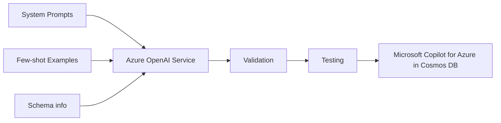
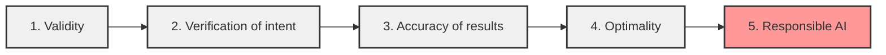
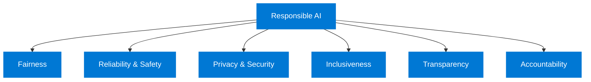

# Azure Cosmos DB Copilot Pipeline

```mermaid
graph LR
    A[System Prompts] --> D[Azure OpenAI Service]
    B[Few-shot Examples] --> D
    C[Schema info] --> D
    D --> E[Validation]
    E --> F[Testing]
    F --> G[Microsoft Copilot for Azure in Cosmos DB]
```

```mermaid
graph LR
    A[1. Validity]
    B[2. Verification of intent]
    C[3. Accuracy of results]
    D[4. Optimality]
    E[5. Responsible AI]
    
    A --> B --> C --> D --> E
    
    style A fill:#f0f0f0,stroke:#333,stroke-width:2px
    style B fill:#f0f0f0,stroke:#333,stroke-width:2px
    style C fill:#f0f0f0,stroke:#333,stroke-width:2px
    style D fill:#f0f0f0,stroke:#333,stroke-width:2px
    style E fill:#ff9999,stroke:#333,stroke-width:2px
```

```mermaid
graph TD
    A[Responsible AI]
    B[Fairness]
    C[Reliability & Safety]
    D[Privacy & Security]
    E[Inclusiveness]
    F[Transparency]
    G[Accountability]

    A --> B
    A --> C
    A --> D
    A --> E
    A --> F
    A --> G

    style A fill:#0078D4,color:#ffffff,stroke:#0078D4,stroke-width:2px
    style B fill:#0078D4,color:#ffffff,stroke:#0078D4,stroke-width:2px
    style C fill:#0078D4,color:#ffffff,stroke:#0078D4,stroke-width:2px
    style D fill:#0078D4,color:#ffffff,stroke:#0078D4,stroke-width:2px
    style E fill:#0078D4,color:#ffffff,stroke:#0078D4,stroke-width:2px
    style F fill:#0078D4,color:#ffffff,stroke:#0078D4,stroke-width:2px
    style G fill:#0078D4,color:#ffffff,stroke:#0078D4,stroke-width:2px

    classDef default fill:#0078D4,color:#ffffff,stroke:#0078D4,stroke-width:2px;
```
