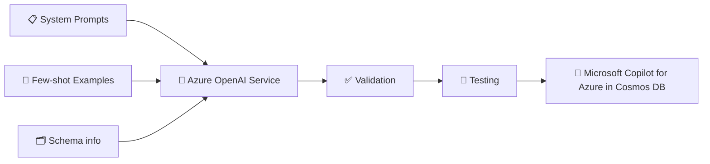
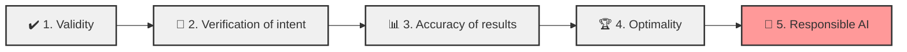
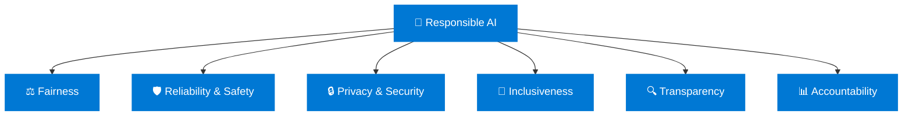
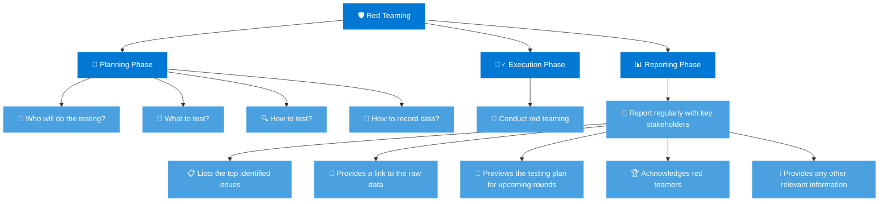
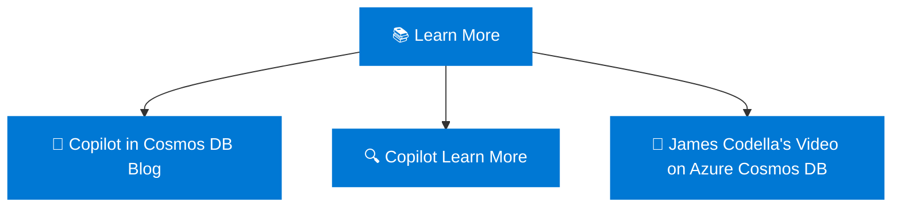

# 🌌 Azure Cosmos DB Copilot Pipeline

## 🚀 Copilot Pipeline Overview

# 🧪 Testing Criteria

# 🤖 Responsible AI Framework

# 🛡️ Red Teaming Process

## 📚 Learn More Resource Links and Reference Video

