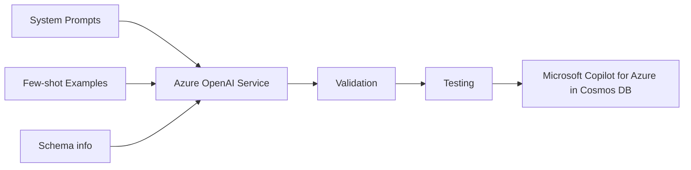
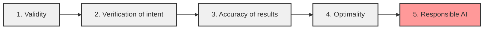
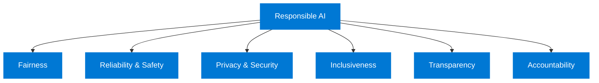
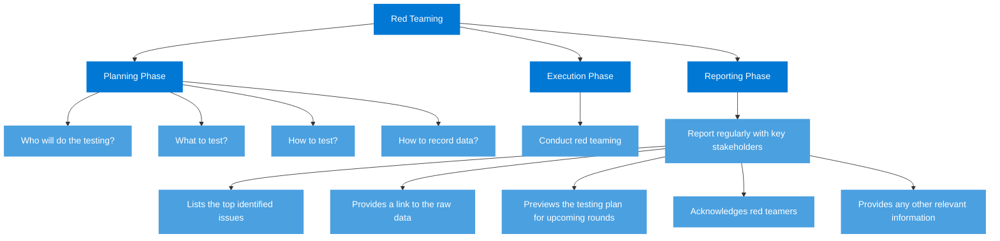
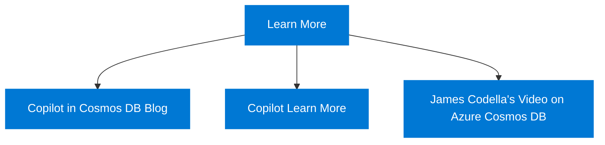

# Azure Cosmos DB Copilot Pipeline

### Based on James Codella of MS Video located here:  https://www.youtube.com/watch?v=STc30jdBwl8&list=PLHgX2IExbFos07Jf1iT2gg94A2IArbmLC&index=3&t=1049s

```mermaid
graph LR
    A[System Prompts] --> D[Azure OpenAI Service]
    B[Few-shot Examples] --> D
    C[Schema info] --> D
    D --> E[Validation]
    E --> F[Testing]
    F --> G[Microsoft Copilot for Azure in Cosmos DB]
```

```mermaid
graph LR
    A[1. Validity]
    B[2. Verification of intent]
    C[3. Accuracy of results]
    D[4. Optimality]
    E[5. Responsible AI]
    
    A --> B --> C --> D --> E
    
    style A fill:#f0f0f0,stroke:#333,stroke-width:2px
    style B fill:#f0f0f0,stroke:#333,stroke-width:2px
    style C fill:#f0f0f0,stroke:#333,stroke-width:2px
    style D fill:#f0f0f0,stroke:#333,stroke-width:2px
    style E fill:#ff9999,stroke:#333,stroke-width:2px
```

```mermaid
graph TD
    A[Responsible AI]
    B[Fairness]
    C[Reliability & Safety]
    D[Privacy & Security]
    E[Inclusiveness]
    F[Transparency]
    G[Accountability]

    A --> B
    A --> C
    A --> D
    A --> E
    A --> F
    A --> G

    style A fill:#0078D4,color:#ffffff,stroke:#0078D4,stroke-width:2px
    style B fill:#0078D4,color:#ffffff,stroke:#0078D4,stroke-width:2px
    style C fill:#0078D4,color:#ffffff,stroke:#0078D4,stroke-width:2px
    style D fill:#0078D4,color:#ffffff,stroke:#0078D4,stroke-width:2px
    style E fill:#0078D4,color:#ffffff,stroke:#0078D4,stroke-width:2px
    style F fill:#0078D4,color:#ffffff,stroke:#0078D4,stroke-width:2px
    style G fill:#0078D4,color:#ffffff,stroke:#0078D4,stroke-width:2px

    classDef default fill:#0078D4,color:#ffffff,stroke:#0078D4,stroke-width:2px;
```

```mermaid
graph TD
    A[Red Teaming]
    
    B[Planning Phase]
    B1[Who will do the testing?]
    B2[What to test?]
    B3[How to test?]
    B4[How to record data?]
    
    C[Execution Phase]
    C1[Conduct red teaming]
    
    D[Reporting Phase]
    D1[Report regularly with key stakeholders]
    D2[Lists the top identified issues]
    D3[Provides a link to the raw data]
    D4[Previews the testing plan for upcoming rounds]
    D5[Acknowledges red teamers]
    D6[Provides any other relevant information]

    A --> B
    A --> C
    A --> D
    
    B --> B1
    B --> B2
    B --> B3
    B --> B4
    
    C --> C1
    
    D --> D1
    D1 --> D2
    D1 --> D3
    D1 --> D4
    D1 --> D5
    D1 --> D6

    classDef default fill:#0078D4,color:#ffffff,stroke:#0078D4,stroke-width:2px;
    class A,B,C,D default;
    classDef subnode fill:#4BA0E0,color:#ffffff,stroke:#4BA0E0,stroke-width:2px;
    class B1,B2,B3,B4,C1,D1,D2,D3,D4,D5,D6 subnode;
```

```mermaid
graph TD
    A[Learn More]
    B[Copilot in Cosmos DB Blog]
    C[Copilot Learn More]
    D[James Codella's Video on Azure Cosmos DB]

    A --> B
    A --> C
    A --> D

    click B "https://aka.ms/CopilotInCosmosDBBlog" _blank
    click C "https://aka.ms/cdb-copilot-learn-more" _blank
    click D "https://www.youtube.com/watch?v=STc30jdBwl8&list=PLHgX2IExbFos07Jf1iT2gg94A2IArbmLC&index=3&t=1049s" _blank

    classDef default fill:#0078D4,color:#ffffff,stroke:#0078D4,stroke-width:2px;
    class A,B,C,D default;
```
